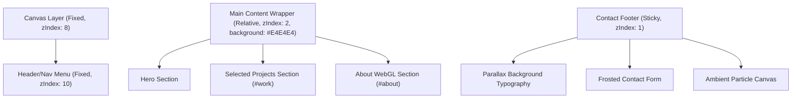
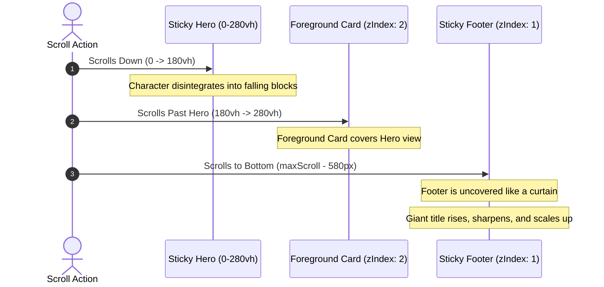

# MOTION LAB: Cinematic Portfolio Landing Page

An interactive, high-end cinematic portfolio landing page built to modern Awwwards standards. It showcases premium layouts, interactive WebGL physics scenes, 2D particle simulations, organic curved section transitions, and sticky scroll reveal transitions.

---

## 1. Project Overview & Build History
The project was built as a next-generation interactive portfolio. The design is structured to balance content legibility with immersive visual feedback.

The construction involved:
1. **Interactive Hero Section**: A high-resolution voxel character model that disintegrates into falling physics blocks when scrolling down, and reassembles segment-by-segment when scrolling back up.
2. **WebGL Interactive About Segment**: A full-screen 3D physics simulation displaying centripetally floating connector elements that assemble and fly around based on cursor proximity.
3. **Curvecap Section Transitions**: Replaced harsh dividing edges with custom parabolic SVG cap wipes to transition smoothly between sections.
4. **Interactive Contact Reveal**: A sticky footer curtain reveal that uncovers the form and copyright, complete with a repelling grid particle canvas, magnetic buttons, and scrambling typography.

---

## 2. Tech Stack
The project is built on a modern TypeScript React stack:

<TechStack>
  <TechItem name="React 18.3.1" icon="react" role="Component lifecycle and UI state orchestration" />
  <TechItem name="Vite" icon="vite" role="Lightning-fast development compiler and bundler" />
  <TechItem name="Three.js" icon="threejs" role="Core WebGL rendering library for 3D assets" />
  <TechItem name="React Three Fiber" icon="r3f" role="React wrapper for declarative Three.js scene assembly" />
  <TechItem name="React Three Drei" icon="drei" role="Utilities and helpers for camera controls and GLB loading" />
  <TechItem name="React Three Rapier" icon="rapier" role="Rigid-body 3D physics engine for connector collisions" />
  <TechItem name="N8AO & Postprocessing" icon="ssao" role="High-performance screen-space ambient occlusion (SSAO)" />
  <TechItem name="HTML5 Canvas 2D" icon="canvas" role="Lightweight physics rendering for Hero blocks and Contact grids" />
  <TechItem name="Vanilla CSS" icon="css" role="Performance-tuned hardware-accelerated animations and layouts" />
</TechStack>

---

## 3. Design Principles
The site is built with a focus on premium, modern web aesthetics:
* **Asymmetrical Stacking Contexts**: Clean boundaries between light gray (`#E4E4E4`) content cards and deep charcoal (`#0a0a0a` / `#111`) dark containers.
* **Organic Scroll Caps**: Replaced sharp section dividers with SVG parabolic sweeps to create a smooth, curved swipe transition when scrolling.
* **Glassmorphic Inputs**: High-end form elements featuring translucent borders, frosted glass backgrounds, and radial cyan box-glows on focus.
* **Typographic Contrast**: Bold, solid white display fonts (`rgba(255,255,255,0.12)`) in the parallax background contrasted against highly legible, fine-weight foreground content.

---

## 4. Animation Techniques
The project utilizes multiple hardware-accelerated animation techniques:
* **Voxel Figurine Disintegration**: Splitting static textures into 2D canvas blocks that undergo gravity calculations and cursor repulsion forces.
* **WebGL Gravity/Centripetal Assembler**: Flying 3D GLB connectors pulled towards a center gravity vector while reacting to magnetic pointer forces.
* **Sticky Footer Reveal (Curtain Effect)**: Stacking the contact section sticky underneath the main wrapper. As the wrapper scrolls up, it reveals the contact section underneath like an opening curtain.
* **Text Scrambling**: Social links that procedurally mutate letters using random characters on hover before settling back to the target text.
* **Center-Out Underlines**: Social link underlines that expand from the center outwards on hover using CSS flex transitions.

---

## 5. Mathematical Foundations

### A. 2D Cursor Repulsion Physics (Contact Canvas Grid)
Each particle tracks its home coordinate \((x_h, y_h)\) and its current velocity \((v_x, v_y)\). When the cursor \((m_x, m_y)\) is within the repulsion radius \(R\), a directional force vector \(\vec{F}\) is applied:

  

    
1. Distance to Cursor

    

      d = &radic;((x - mx)2 + (y - my)2)
    

  

  

    
2. Repulsion Force Directional Scaling

    
Applied only when the distance <code className="font-mono text-foreground bg-muted/40 px-1 py-0.5 rounded">d</code> is less than the repulsion radius <code className="font-mono text-foreground bg-muted/40 px-1 py-0.5 rounded">R</code>:

    

      f = (R - d) / R
    

  

  

    
3. Velocity and Spring Restoration Update

    

      
vx &larr; vx + ((x - mx) / d) &times; f &times; S

      
vy &larr; vy + ((y - my) / d) &times; f &times; S

    

    
Where <code className="font-mono text-foreground bg-muted/40 px-1 py-0.5 rounded">S</code> is the force strength. Restoring spring forces <code className="font-mono text-foreground bg-muted/40 px-1 py-0.5 rounded">K</code> and friction <code className="font-mono text-foreground bg-muted/40 px-1 py-0.5 rounded">D</code> are applied next:

    

      
vx &larr; vx &times; D + (xh - x) &times; K

      
vy &larr; vy &times; D + (yh - y) &times; K

    

  

---

### B. Scroll Reveal Progress & Parallax
The sticky reveal progress \(P_r\) of the footer is mapped to the scroll position \(S_y\) relative to the maximum document scroll height \(S_{max}\) and footer height \(H_f\):

  

    
1. Sticky Reveal Progress Calculation

    

      Pr = max(0, min(1, (Sy - (Smax - Hf)) / Hf))
    

    
Mapped from the scroll position <code className="font-mono text-foreground bg-muted/40 px-1 py-0.5 rounded">Sy</code> relative to maximum document scroll height <code className="font-mono text-foreground bg-muted/40 px-1 py-0.5 rounded">Smax</code> and footer height <code className="font-mono text-foreground bg-muted/40 px-1 py-0.5 rounded">Hf</code>.

  

  

    
2. Typography Parallax Visual Interpolation

    

      
Translation (Y) = (1 - Pr) &times; 140px

      
Scale = 0.93 + (Pr &times; 0.07)

      
Blur = (1 - Pr) &times; 12px

    

  

---

### C. Organic Curve Coordinate Function
The curved cap transition at the top of `#work` is defined dynamically by an SVG cubic Bezier curve relative to a responsive coordinate space:

  
SVG Bezier Curve Definition

  

    d = "M0,100 C " + (W &times; 0.33) + ",0 " + (W &times; 0.66) + ",0 " + W + ",100 Z"
  

  
Where <code className="font-mono text-foreground bg-muted/40 px-1 py-0.5 rounded">W</code> is the viewport width, rendering a parabolic sweep that adapts to any screen resolution.

---

## 6. Architecture & Stacking Diagrams

### A. Layout Stacking Context (Z-Index Layering)
The following diagram illustrates how layers are stacked to create the sticky uncover reveal effect:

### B. Scroll Reveal Flow
The following sequence diagram shows the transition of layers as the user scrolls from the Hero section down to the footer:

