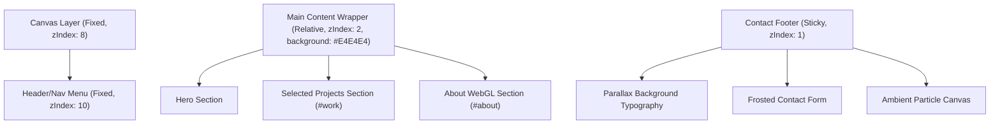
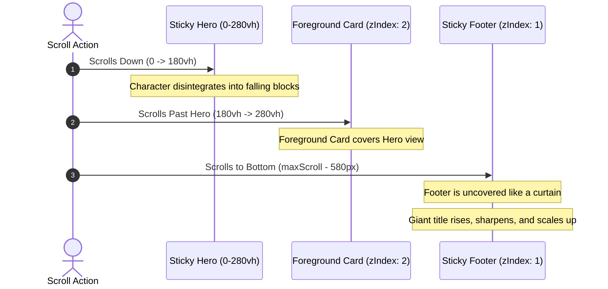

# MOTION LAB: Cinematic Portfolio Landing Page

An interactive, high-end cinematic portfolio landing page built to modern Awwwards standards. It showcases premium layouts, interactive WebGL physics scenes, 2D particle simulations, organic curved section transitions, and sticky scroll reveal transitions.

---

## 1. Project Overview & Build History
The project was built as a next-generation interactive portfolio. The design is structured to balance content legibility with immersive visual feedback.

The construction involved:
1. **Interactive Hero Section**: A high-resolution voxel character model that disintegrates into falling physics blocks when scrolling down, and reassembles segment-by-segment when scrolling back up.
2. **WebGL Interactive About Segment**: A full-screen 3D physics simulation displaying centripetally floating connector elements that assemble and fly around based on cursor proximity.
3. **Curvecap Section Transitions**: Replaced harsh dividing edges with custom parabolic SVG cap wipes to transition smoothly between sections.
4. **Interactive Contact Reveal**: A sticky footer curtain reveal that uncovers the form and copyright, complete with a repelling grid particle canvas, magnetic buttons, and scrambling typography.

---

## 2. Tech Stack
The project is built on a modern TypeScript React stack:

| Technology / Library | Role in Project |
| :--- | :--- |
| **React 18.3.1** | Component lifecycle and UI state orchestration |
| **Vite** | Lightning-fast development compiler and bundler |
| **Three.js** | Core WebGL rendering library for 3D assets |
| **React Three Fiber (R3F)** | React wrapper for declarative Three.js scene assembly |
| **React Three Drei** | Utilities and helpers for camera controls and GLB loading |
| **React Three Rapier** | Rigid-body 3D physics engine for connector collisions |
| **N8AO & Postprocessing** | High-performance screen-space ambient occlusion (SSAO) |
| **HTML5 Canvas 2D** | Lightweight physics rendering for Hero blocks and Contact grids |
| **Vanilla CSS** | Performance-tuned hardware-accelerated animations and layouts |

---

## 3. Design Principles
The site is built with a focus on premium, modern web aesthetics:
* **Asymmetrical Stacking Contexts**: Clean boundaries between light gray (`#E4E4E4`) content cards and deep charcoal (`#0a0a0a` / `#111`) dark containers.
* **Organic Scroll Caps**: Replaced sharp section dividers with SVG parabolic sweeps to create a smooth, curved swipe transition when scrolling.
* **Glassmorphic Inputs**: High-end form elements featuring translucent borders, frosted glass backgrounds, and radial cyan box-glows on focus.
* **Typographic Contrast**: Bold, solid white display fonts (`rgba(255,255,255,0.12)`) in the parallax background contrasted against highly legible, fine-weight foreground content.

---

## 4. Animation Techniques
The project utilizes multiple hardware-accelerated animation techniques:
* **Voxel Figurine Disintegration**: Splitting static textures into 2D canvas blocks that undergo gravity calculations and cursor repulsion forces.
* **WebGL Gravity/Centripetal Assembler**: Flying 3D GLB connectors pulled towards a center gravity vector while reacting to magnetic pointer forces.
* **Sticky Footer Reveal (Curtain Effect)**: Stacking the contact section sticky underneath the main wrapper. As the wrapper scrolls up, it reveals the contact section underneath like an opening curtain.
* **Text Scrambling**: Social links that procedurally mutate letters using random characters on hover before settling back to the target text.
* **Center-Out Underlines**: Social link underlines that expand from the center outwards on hover using CSS flex transitions.

---

## 5. Mathematical Foundations

### A. 2D Cursor Repulsion Physics (Contact Canvas Grid)
Each particle tracks its home coordinate \((x_h, y_h)\) and its current velocity \((v_x, v_y)\). When the cursor \((m_x, m_y)\) is within the repulsion radius \(R\), a directional force vector \(\vec{F}\) is applied:

\[d = \sqrt\{(x - m_x)^2 + (y - m_y)^2\}\]
\[\text\{If \} d < R: \quad f = \frac\{R - d\}\{R\}\]
\[v_x \leftarrow v_x + \left(\frac\{x - m_x\}\{d\}\right) \times f \times S\]
\[v_y \leftarrow v_y + \left(\frac\{y - m_y\}\{d\}\right) \times f \times S\]

Where \(S\) is the force strength. Particles automatically apply a friction coefficient \(D\) and a restoring spring force \(K\) towards their home position:
\[v_x \leftarrow v_x \times D + (x_h - x) \times K\]
\[v_y \leftarrow v_y \times D + (y_h - y) \times K\]

---

### B. Scroll Reveal Progress & Parallax
The sticky reveal progress \(P_r\) of the footer is mapped to the scroll position \(S_y\) relative to the maximum document scroll height \(S_\{max\}\) and footer height \(H_f\):

\[P_r = \max\left(0, \min\left(1, \frac\{S_y - (S_\{max\} - H_f)\}\{H_f\}\right)\right)\]

The visual properties of the giant background title interpolate as follows:
\[\text\{Translation (Y)\} = (1 - P_r) \times 140\text\{ px\}\]
\[\text\{Scale\} = 0.93 + (P_r \times 0.07)\]
\[\text\{Blur\} = (1 - P_r) \times 12\text\{ px\}\]

---

### C. Organic Curve Coordinate Function
The curved cap transition at the top of `#work` is defined dynamically by an SVG cubic Bezier curve relative to a responsive coordinate space:

\[d = \text{"M0,100 C" } + (W \times 0.33) + \text{",0 " } + (W \times 0.66) + \text{",0 " } + W + \text{",100 Z"}\]

Where \(W\) is the viewport width, rendering a parabolic sweep that adapts to any screen resolution.

---

## 6. Architecture & Stacking Diagrams

### A. Layout Stacking Context (Z-Index Layering)
The following diagram illustrates how layers are stacked to create the sticky uncover reveal effect:

### B. Scroll Reveal Flow
The following sequence diagram shows the transition of layers as the user scrolls from the Hero section down to the footer:

