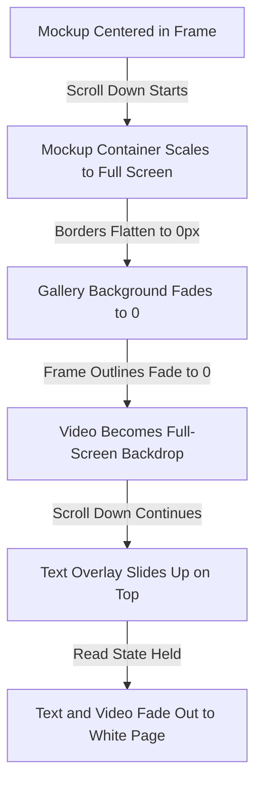
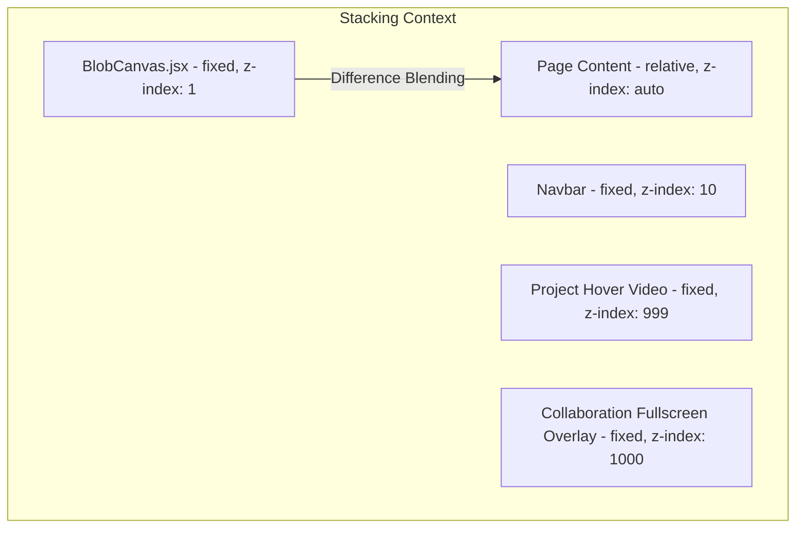
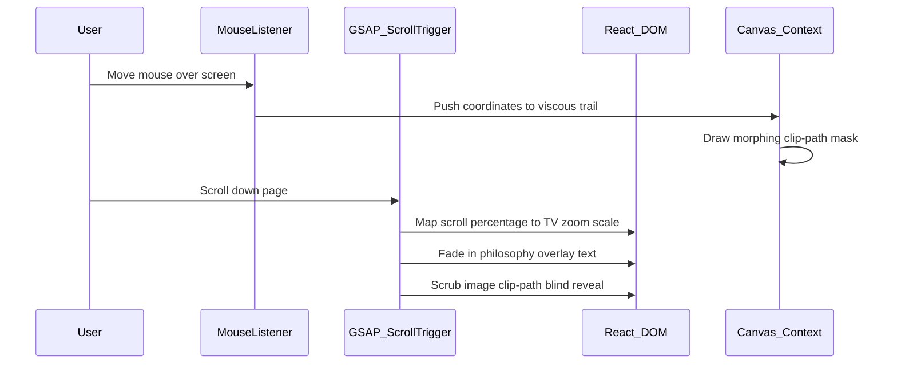

# Motion Lab — Creative Studio Platform
### Technical Case Study & Architecture Manifesto

This document provides a comprehensive technical breakdown of **Motion Lab**, a high-end creative agency portfolio clone built to showcase interactive 3D WebGL-like canvases, fluid physics, and storytelling scroll transitions.

---

## 1. How the Project Was Built

The construction of the Motion Lab platform followed an iterative, interaction-first engineering pipeline:

1. **Skeleton Set-up**: Scaffolded a minimal, fast-compiling React project using **Vite** to establish instant Hot Module Replacement (HMR) for visual tweaking.
2. **Physics Engine Implementation**: Constructed the custom 2D/3D background canvas in [BlobCanvas.jsx](file:///C:/Users/SAYAN%20SOM/.gemini/antigravity/scratch/sayanblob-clone/src/components/3D/BlobCanvas.jsx), modeling the core brand title (`MOTION LAB`) with path-clipping masks.
3. **Cursor Blend Inversion**: Designed CSS stacking contexts in [index.css](file:///C:/Users/SAYAN%20SOM/.gemini/antigravity/scratch/sayanblob-clone/src/index.css) to isolate text headers, enabling `mix-blend-mode: difference` so typography shifts dynamically from black (on white paper) to white (over the dark canvas liquid).
4. **Scroll Orchestration**: Wired **GSAP** and **ScrollTrigger** to control multi-phase scroll timelines, transforming sections from pinned editorial slides into full-bleed cinematic backgrounds.
5. **Tactile Interaction Layer**: Created custom cursor followers, custom option lists, tactile selection pill matrices, and micro-interactive slide-out subpages to handle project inquiries.

---

## 2. Tech Stack

The application leverages a lightweight, performance-tuned frontend stack:

<TechStack>
  <TechItem name="React 18" icon="react" role="Component management and sub-second hot reload cycles." />
  <TechItem name="HTML5 Canvas API" icon="html" role="High-rate rendering loop (60fps) for procedural noise and mouse tracking." />
  <TechItem name="GSAP (GreenSock)" icon="gsap" role="Timeline orchestration, smooth lagging follower physics, and scroll scrubbing." />
  <TechItem name="ScrollTrigger Plugin" icon="threejs" role="Bounding pins, parallax coordinate multipliers, and scroll-linked viewport transitions." />
  <TechItem name="Lucide React" icon="react" role="Clean, scale-invariant SVG vector icons." />
  <TechItem name="Vanilla CSS3" icon="css" role="Custom variables, layout grids, backdrop-blur filters, and difference blending modes." />
</TechStack>

---

## 3. Mathematical Foundations

The fluid, organic interactions on the page are driven by procedural coordinate models and ease interpolation equations.

### A. Viscous Linear Interpolation (Lerp Chain)
Rather than standard spring-mass velocity equations (which cause bouncy oscillations), the fluid trail follows a viscous chain of coordinates linked by progressive linear interpolation. This creates a heavy, dragging, liquid-like behavior.

Given a series of points \(P_0, P_1, \dots, P_n\) in the tracking chain, where \(P_0\) is the cursor position:

  

    
Viscous Lerp Update Formula

    

      Pi(t) = Pi(t - 1) + (Pi - 1(t) - Pi(t - 1)) &times; &alpha;
    

    

      Where <code className="font-mono text-foreground bg-muted/40 px-1 py-0.5 rounded">&alpha; &in; [0.1, 0.35]</code> represents the viscous drag coefficient (damping factor). The lower the <code className="font-mono text-foreground bg-muted/40 px-1 py-0.5 rounded">&alpha;</code>, the heavier and more viscous the fluid feels as it lags behind the cursor.
    

  

---

### B. Procedural Fluid Deformations (Perlin Noise)
To make the canvas splash look organic and alive, the boundary of the cursor splash cloud is deformed dynamically using a noise displacement function:

  

    
Boundary Deformation Formula

    

      R(&theta;) = Rbase + Noise(cos(&theta;) &times; f, sin(&theta;) &times; f + t &times; s) &times; A
    

    

      Where <code className="font-mono text-foreground bg-muted/40 px-1 py-0.5 rounded">Rbase</code> is the base radius, <code className="font-mono text-foreground bg-muted/40 px-1 py-0.5 rounded">&theta;</code> is the angle, <code className="font-mono text-foreground bg-muted/40 px-1 py-0.5 rounded">f</code> is frequency, <code className="font-mono text-foreground bg-muted/40 px-1 py-0.5 rounded">t &times; s</code> is a time-drift offset, and <code className="font-mono text-foreground bg-muted/40 px-1 py-0.5 rounded">A</code> is amplitude.
    

  

---

### C. Confetti Particle Trajectory
The particle burst on successful form submission uses classical physics kinematics simulated on canvas:

  

    
Confetti Kinematic Equations

    

      
X(t) = X0 + Vx &times; t

      
Y(t) = Y0 + Vy &times; t + &frac12; &times; g &times; t2

      
Alpha(t) = 1.0 - d &times; t

    

    

      Where <code className="font-mono text-foreground bg-muted/40 px-1 py-0.5 rounded">Vx, Vy</code> are randomized initial velocity vectors, <code className="font-mono text-foreground bg-muted/40 px-1 py-0.5 rounded">g = 0.18</code> is gravity pull downward, and <code className="font-mono text-foreground bg-muted/40 px-1 py-0.5 rounded">d</code> is a random decay factor (0.012 to 0.027) controlling fade-out rate.
    

  

---

## 4. Design Principles

The visual layout of Motion Lab centers around contemporary high-end design aesthetics:

*   **Achromatic Contrast with Highlight**: Settle on a strict high-contrast backdrop (deep rich blacks, clean solid whites) with a single selected highlight color—a sharp **neon lime green (`#bfff00`)** used for active status indicators and overlays.
*   **Typography Hierarchy**: Leverage **Syne** (an ultra-wide geometric sans-serif) for high-impact titles, coupled with **Space Grotesk** for clean copy and mono-spaced labels for technical metadata.
*   **Difference Blending Context Isolation**: By resetting container `z-index` values to `auto`, the page prevents the creation of isolated stacking contexts. This permits text with `mix-blend-mode: difference` to blend across DOM layers directly with the canvas underlay.
*   **Tactile Feedback (Glassmorphism)**: UI cards (inquiry card, hover video windows) feature dense background blurs (`backdrop-filter: blur(25px)`) and micro-thin borders, making them feel like physical frosted glass floating above the content.

---

## 5. Animation Techniques

The website utilizes a series of scroll-linked and hover-triggered micro-interactions:

### A. Zoom Shutter Portal scroll
To transition between the TV Mockup and the next fold, a GSAP timeline maps viewport scroll-scrub coordinates to:
- Expanding the container width from `90%` to `100%`.
- Shrinking the container's corner border-radius from `16px` to `0px`.
- Fading out the wood frame and gallery wall background to `0`.
- Letting the video element take over as a full-bleed backdrop.

### B. Shutter Mask Image Reveal
The manifesto image is revealed on viewport entry using a CSS `clip-path` mask animation:
- **Initial State**: `clip-path: inset(100% 0% 0% 0%)` (completely hidden from the bottom).
- **Revealed State**: `clip-path: inset(0% 0% 0% 0%)` (fully slides open like a shutter blind).
- **Parallax Action**: As the user scrolls, the image itself shifts vertically (`yPercent: -12` to `12`) at a slower rate than the container, creating depth.

### C. Cursor-Following Video Preview
When hovering over projects in the **Selected Works** list:
- A hidden fixed card (`width: 320px`, `height: 180px`) fades and scales up (`scale(0.85)` -> `scale(1)`).
- A mousemove listener uses GSAP to continuously animate the position of the card container to match client coordinates `(clientX, clientY)` with a subtle tracking delay (`duration: 0.3`, ease: `power2.out`).
- Inside the card, the corresponding project video automatically triggers muted loop playback.

---

## 6. Structural Diagrams

### A. Component Stacking & Overlay Hierarchy
This diagram maps how the layout layers are stacked, enabling background blending and fullscreen overlays.

### B. Project Data Flow & Interaction Pipeline
How interactions (mouse movements and scroll trigger offsets) feed into the rendering loops and animators.

---

## 📊 Scroll & Cursor Follower Hand-Drawn Sketch Explanation

The Excalidraw-style sketch below breaks down the page layout coordinates, scroll-timeline increments (0vh to 9.5vh), expanding card dimensions, and cursor tracking offsets:

